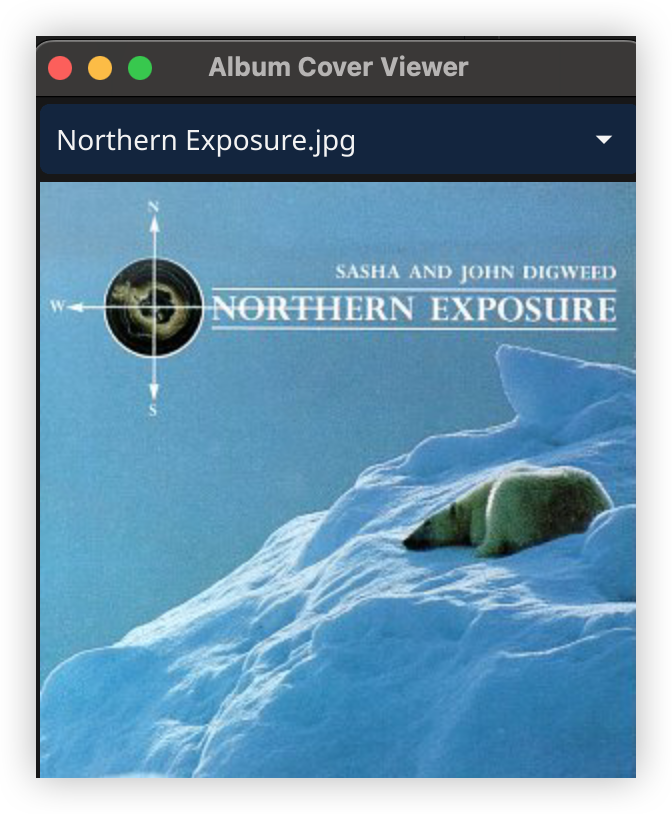

# head-first-design-pattern-go
Implement head-first-design-pattern using golang.

Develop env: mac

Some cases in the tutorial depend on a specific Java package. In order to implement with Golang, I have made some adjustments. Trying to restore the effects in the tutorial while following the aim pattern. The changes are listed below:

### chapter-11-proxy
virtual-proxy: implement an album cover viewer. [fyne](https://docs.fyne.io/) for UI rendering.

